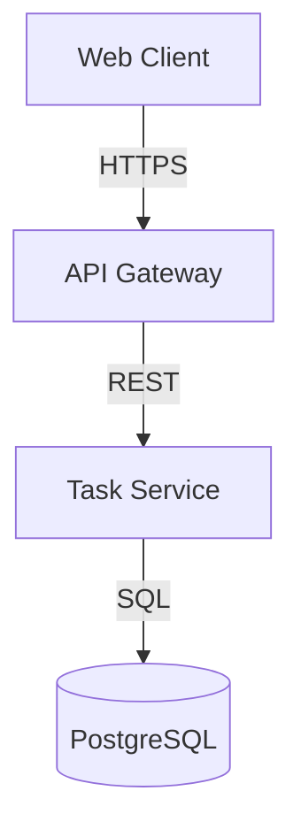

# Design Authoring Skill

## Overview

This skill focuses on creating technical design documents that translate requirements from `specs/requirements.md` into implementable solutions. The output follows the format defined in `specs/design.md`.

## Document Format

Design documents include these main sections:

### 1. Overview
High-level description of the solution approach, key technologies, and architectural style.

### 2. Architecture
- **System Components**: Mermaid diagram showing main components and data flow
- **Component descriptions**: Purpose and responsibilities of each component
- **Component Interactions**: How components communicate (request/response, events, etc.)

**Example Mermaid**:


### 3. Data Models
SQL schemas or data structures with:
- Table definitions with all fields and types
- Indexes for performance
- Relationships between entities

### 4. API Design
For each endpoint:
- Method and Path
- Description
- Authentication requirements
- Request body example (JSON)
- Response example (JSON)
- Error codes with descriptions

### 5. Cross-cutting Concerns
- **Security**: Authentication, authorization, data protection
- **Performance**: Expected load, caching, optimization
- **Testing**: Unit, integration, end-to-end strategies
- **Deployment**: Infrastructure, rollout plan, monitoring

### 6. Trade-offs and Alternatives
Document key decisions with:
- Chosen approach description
- Alternatives considered (with pros/cons)
- Rationale for the choice

## Key Capabilities

- Creating system architecture diagrams with Mermaid
- Defining database schemas and relationships
- Documenting REST APIs with examples
- Analyzing and documenting technical trade-offs
- Considering security, performance, and operational aspects

## Best Practices

- **Requirements-driven**: Every design element should trace back to requirements
- **Start high-level**: Begin with architecture, then add details progressively
- **Concrete examples**: Include actual JSON, SQL, and code snippets
- **Justify decisions**: Document why, not just what
- **Consider operations**: Think about deployment, monitoring, scaling
- **Visual clarity**: Use diagrams for complex interactions
- **Complete API specs**: Include request, response, and error examples

## Working with the Template

1. **Read requirements**: Understand `specs/requirements.md` thoroughly
2. **Review template**: Study `specs/design.md` structure and examples
3. **Draft architecture**: Start with high-level component diagram
4. **Define data models**: Design database schema for requirements
5. **Specify APIs**: Document all endpoints with examples
6. **Address quality attributes**: Security, performance, testing, deployment
7. **Document decisions**: Explain key trade-offs and alternatives
8. **Iterate**: Refine based on feedback

## Example API Design

```markdown
### Endpoint: Create Task

- **Method**: POST
- **Path**: `/api/v1/tasks`
- **Description**: Creates a new task and assigns it to a team member
- **Authentication**: Required (JWT token)
- **Request**:
  ```json
  {
    "title": "Implement user authentication",
    "description": "Add JWT-based auth with refresh tokens",
    "assignee_id": "550e8400-e29b-41d4-a716-446655440000",
    "due_date": "2024-12-31T23:59:59Z"
  }
  ```
- **Response** (201 Created):
  ```json
  {
    "id": "123e4567-e89b-12d3-a456-426614174000",
    "title": "Implement user authentication",
    "status": "todo",
    "created_at": "2024-01-15T10:30:00Z"
  }
  ```
- **Error Codes**: 
  - 400: Invalid request body
  - 401: Unauthorized
  - 404: Assignee not found
```

## Related Skills

- **Spec Authoring**: Provides input requirements
- **Task Breakdown**: Uses design as input for implementation planning

## Tips for Agents

- Use Mermaid for architecture diagrams (proper markdown code blocks)
- Include version numbers for all technologies and libraries
- Provide concrete examples, not just placeholders
- Link design elements back to specific requirements
- Remove example content and replace with actual project design
- Keep "Notes for Agents" section until document is finalized
