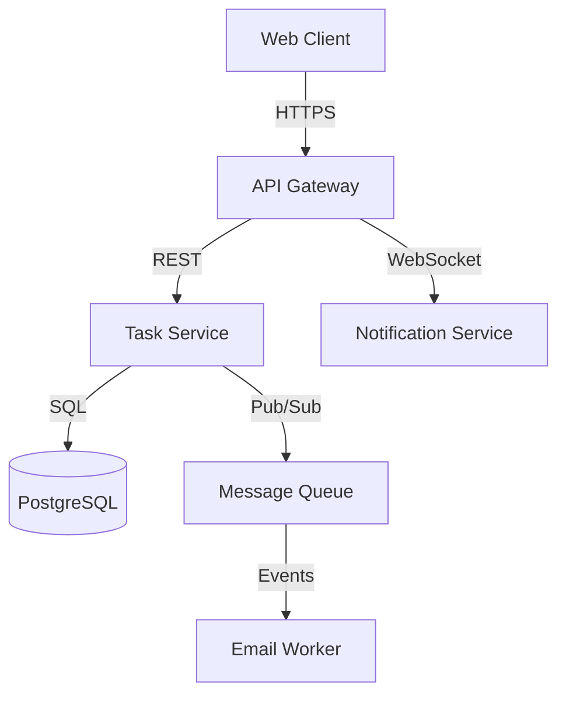

# Technical Design

## Overview

[Provide a high-level description of the solution approach, key technologies, and architectural style (e.g., microservices, monolithic, event-driven)]

**Example**: This design implements an asynchronous task management system using a RESTful API backend with React frontend. The architecture follows a layered approach with clear separation between API, business logic, and data access layers. Real-time updates are handled via WebSocket connections for collaborative features.

## Architecture

### System Components



**Components:**
- **Web Client**: React SPA with Redux state management, handles UI and user interactions
- **API Gateway**: Express.js server, handles authentication, rate limiting, and request routing
- **Task Service**: Core business logic for task CRUD operations, assignments, and status management
- **Notification Service**: WebSocket server for real-time updates, maintains active client connections
- **PostgreSQL Database**: Persistent storage for tasks, users, time entries with JSONB for flexible metadata
- **Message Queue**: Redis-based pub/sub for async operations like email notifications and analytics
- **Email Worker**: Background processor for notification emails using template engine

### Component Interactions

**Task Creation Flow:**
1. Client sends POST request to API Gateway with task data
2. API Gateway validates JWT token and forwards to Task Service
3. Task Service validates data, creates task in database
4. Task Service publishes TaskCreated event to Message Queue
5. Notification Service receives event and broadcasts to connected clients
6. Email Worker receives event and sends notification email to assignee

---

## Table of Contents

- [Data Models](#data-models)
- [API Design](#api-design)
- [Security Considerations](#security-considerations)
- [Performance Considerations](#performance-considerations)
- [Testing Strategy](#testing-strategy)
- [Deployment Strategy](#deployment-strategy)
- [Trade-offs and Alternatives](#trade-offs-and-alternatives)
- [Open Questions](#open-questions)
- [Dependencies](#dependencies)
- [Risks](#risks)

---

## Data Models

### Entity: Task

```sql
CREATE TABLE tasks (
    id UUID PRIMARY KEY DEFAULT gen_random_uuid(),
    title VARCHAR(200) NOT NULL,
    description TEXT,
    status VARCHAR(50) NOT NULL DEFAULT 'todo',
    assignee_id UUID REFERENCES users(id),
    created_by UUID REFERENCES users(id) NOT NULL,
    created_at TIMESTAMP DEFAULT NOW(),
    updated_at TIMESTAMP DEFAULT NOW(),
    due_date TIMESTAMP,
    metadata JSONB DEFAULT '{}'
);

CREATE INDEX idx_tasks_assignee ON tasks(assignee_id);
CREATE INDEX idx_tasks_status ON tasks(status);
```

**Relationships:**
- Task belongs to one User (assignee)
- Task belongs to one User (creator)
- Task has many TimeEntries
- Task has many Comments

### Entity: TimeEntry

```sql
CREATE TABLE time_entries (
    id UUID PRIMARY KEY DEFAULT gen_random_uuid(),
    task_id UUID REFERENCES tasks(id) ON DELETE CASCADE,
    user_id UUID REFERENCES users(id),
    start_time TIMESTAMP NOT NULL,
    end_time TIMESTAMP,
    duration_minutes INT,
    notes TEXT,
    created_at TIMESTAMP DEFAULT NOW()
);
```

## API Design

### Endpoint: Create Task

- **Method**: POST
- **Path**: `/api/v1/tasks`
- **Description**: Creates a new task and assigns it to a team member
- **Authentication**: Required (JWT Bearer token)
- **Request**:
  ```json
  {
    "title": "Implement user authentication",
    "description": "Add JWT-based auth with refresh tokens",
    "assignee_id": "550e8400-e29b-41d4-a716-446655440000",
    "due_date": "2024-12-31T23:59:59Z",
    "metadata": {
      "priority": "high",
      "tags": ["backend", "security"]
    }
  }
  ```
- **Response** (201 Created):
  ```json
  {
    "id": "123e4567-e89b-12d3-a456-426614174000",
    "title": "Implement user authentication",
    "status": "todo",
    "created_at": "2024-01-15T10:30:00Z",
    "assignee": {
      "id": "550e8400-e29b-41d4-a716-446655440000",
      "name": "John Doe"
    }
  }
  ```
- **Error Codes**: 
  - 400: Invalid request body or missing required fields
  - 401: Unauthorized (invalid or missing token)
  - 404: Assignee user not found
  - 500: Internal server error

### Endpoint: Start Time Tracking

- **Method**: POST
- **Path**: `/api/v1/tasks/{taskId}/time-entries`
- **Description**: Starts tracking time for a task
- **Request**:
  ```json
  {
    "start_time": "2024-01-15T14:00:00Z"
  }
  ```
- **Response** (201 Created):
  ```json
  {
    "id": "789e4567-e89b-12d3-a456-426614174111",
    "task_id": "123e4567-e89b-12d3-a456-426614174000",
    "start_time": "2024-01-15T14:00:00Z",
    "is_active": true
  }
  ```

## Security Considerations

### Authentication
- JWT tokens with 15-minute expiration for access tokens
- Refresh tokens with 7-day expiration stored in HTTP-only cookies
- PKCE flow for public clients (mobile apps)

### Authorization
- Role-based access control (Admin, Team Lead, Team Member)
- Users can only view/edit tasks in their assigned workspaces
- Row-level security in database for multi-tenant isolation

### Data Protection
- All API communication over HTTPS (TLS 1.3)
- Passwords hashed with bcrypt (cost factor 12)
- Personal data encrypted at rest using AES-256
- Regular security audits and dependency scanning

## Performance Considerations

### Expected Load
- 100 concurrent users per workspace
- Average 50 requests per minute per user
- Peak load: 500 concurrent WebSocket connections

### Caching Strategy
- Redis cache for user sessions (TTL: 15 minutes)
- Application-level cache for task lists (invalidate on updates)
- CDN caching for static assets (1 week TTL)

### Optimization Plans
- Database query optimization with proper indexes
- Connection pooling (min: 10, max: 50 connections)
- Lazy loading for task history and comments
- Pagination for task lists (25 items per page)

## Testing Strategy

### Unit Tests
- Service layer business logic (target: 90% coverage)
- Data validation and transformation functions
- Utility functions and helpers

### Integration Tests
- API endpoints with database interactions
- WebSocket connection and message broadcasting
- Email worker processing and template rendering

### End-to-End Tests
- Complete user workflows: create task → assign → track time → complete
- Multi-user collaboration scenarios
- Real-time update propagation

## Deployment Strategy

### Infrastructure
- Containerized deployment using Docker
- Kubernetes orchestration for auto-scaling
- PostgreSQL managed service (RDS or equivalent)
- Redis managed service for session storage

### Rollout Plan
- Blue-green deployment for zero-downtime updates
- Canary releases: 10% → 50% → 100% over 24 hours
- Feature flags for gradual feature rollout
- Database migrations with rollback capability

### Monitoring
- Application metrics: response time, error rate, throughput
- Infrastructure metrics: CPU, memory, disk, network
- Business metrics: active users, tasks created, time tracked
- Log aggregation with structured logging (JSON format)
- Alert thresholds: error rate >1%, response time >500ms

## Trade-offs and Alternatives

### Decision: WebSocket for Real-time Updates

**Chosen Approach**: WebSocket connections with fallback to polling

**Alternatives Considered**:
1. **Server-Sent Events (SSE)**: 
   - Pros: Simpler protocol, automatic reconnection
   - Cons: Unidirectional, poor IE support, more overhead for bi-directional needs
2. **Long Polling**: 
   - Pros: Universal browser support, simpler implementation
   - Cons: Higher latency, more server resources, scaling challenges

**Rationale**: WebSockets provide bi-directional communication needed for collaborative features with lower latency and better resource efficiency at scale. Modern browser support is excellent, and fallback handles edge cases.

### Decision: PostgreSQL for Primary Database

**Chosen Approach**: PostgreSQL with JSONB for flexible metadata

**Alternatives Considered**:
1. **MongoDB**: 
   - Pros: Flexible schema, horizontal scaling
   - Cons: Weaker consistency guarantees, less mature for complex queries
2. **MySQL**: 
   - Pros: Wide adoption, good performance
   - Cons: Less feature-rich JSON support, weaker full-text search

**Rationale**: PostgreSQL offers ACID compliance needed for task management while providing excellent JSON support for flexible metadata without sacrificing relational integrity. Superior full-text search and mature ecosystem.

## Open Questions

- [ ] Should we implement offline-first capability with local storage sync?
- [ ] What's the data retention policy for completed tasks?
- [ ] Do we need audit logs for compliance requirements?
- [ ] Should time tracking support manual adjustments retroactively?

## Dependencies

- **External Services**: SendGrid for transactional emails, AWS S3 for file attachments
- **Third-party Libraries**: React 18, Express 4, Socket.io 4, Sequelize ORM 6
- **Infrastructure**: Kubernetes cluster, managed PostgreSQL, Redis cluster

## Risks

- **Risk**: WebSocket connection limits on load balancers
  - **Impact**: High - Could prevent real-time updates at scale
  - **Mitigation**: Load test WebSocket capacity, implement connection pooling, configure load balancer for long-lived connections

- **Risk**: Database write contention on popular tasks
  - **Impact**: Medium - Could cause update conflicts
  - **Mitigation**: Implement optimistic locking, use database-level conflict resolution, consider event sourcing for high-traffic tasks

## Notes for Agents

**When filling this template:**
- Replace example content with your actual system design
- Keep architecture diagrams high-level (3-7 main components)
- Include concrete examples for API requests/responses
- Specify actual technologies and versions
- Document rationale for key decisions in Trade-offs section
- Update Open Questions as design evolves
- Remove this notes section in final document
