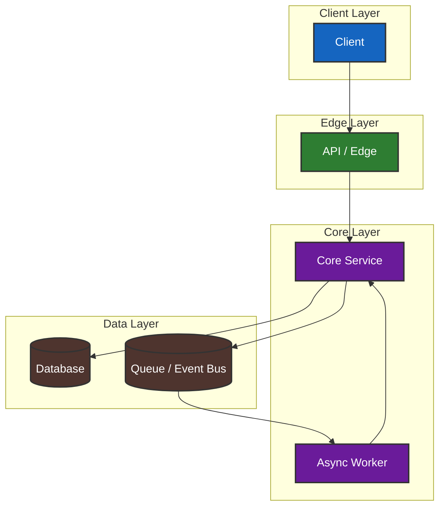

# Technical Design

## Table of Contents

- [Overview](#overview)
- [Architecture](#architecture)
  - [System Components](#system-components)
  - [Component Interactions](#component-interactions)
- [Data Models](#data-models)
- [Interfaces](#interfaces)
- [Security Considerations](#security-considerations)
- [Performance Considerations](#performance-considerations)
- [Testing Strategy](#testing-strategy)
- [Deployment Strategy](#deployment-strategy-optional)
- [Trade-offs and Alternatives](#trade-offs-and-alternatives)
- [Open Questions](#open-questions)
- [Dependencies](#dependencies)
- [Risks](#risks)

---

## Overview

[Provide a high-level description of the solution approach, key technologies, and architectural style (e.g., microservices, monolithic, event-driven)]

---

## Architecture

### System Components

[Include a Mermaid diagram for visualization. Use the following as an example]

```mermaid
graph TD
    A[Client] --> B[API / Edge]
    B --> C[Core Service]
    C --> D[(Database)]
    C --> E[(Queue / Event Bus)]
    E --> F[Async Worker]
    F --> C

    subgraph "Client Layer"
        A
    end

    subgraph "Edge Layer"
        B
    end

    subgraph "Core Layer"
        C
        F
    end

    subgraph "Data Layer"
        D
        E
    end

    style A fill:#1565c0,stroke:#333,stroke-width:2px,color:#fff
    style B fill:#2e7d32,stroke:#333,stroke-width:2px,color:#fff
    style C fill:#6a1b9a,stroke:#333,stroke-width:2px,color:#fff
    style F fill:#6a1b9a,stroke:#333,stroke-width:2px,color:#fff
    style D fill:#4e342e,stroke:#333,stroke-width:2px,color:#fff
    style E fill:#4e342e,stroke:#333,stroke-width:2px,color:#fff
```

**Components:**

- **[Component_1]** — [Description of component, its responsibilities, and interactions (1-2 sentences)]
- **[Component_2]** — [Description of component, its responsibilities, and interactions (1-2 sentences)]

### Component Interactions

#### [Flow_001 - Flow name] 

**Goal**: [What is the purpose of this flow?]

> Describe how **components** interact in this flow, step by step. Include specific function calls, data transformations, and any relevant details.

1. ...
2. ...

**Failure modes:**

- WHEN **[validation fails]**, THE system SHALL **[action]**

---

## Data Models

> Keep it conceptual. Full schemas/migrations belong to implementation

### Entity: [EntityName]

**Purpose**: [What does this entity represent?]

**Key Fields:**

- `id`: [Type] - [Description]
- `field_1`: [Type] - [Description]
- `field_2`: [Type] - [Description]

**Constraints / Invariants:**

- [e.g., unique per X]
- [e.g., must be non-null if Y is true]
- [e.g., value must be within a certain range]

**Relationships:**

- [EntityName] has a [one-to-many/many-to-many/one-to-one] relationship with [RelatedEntity] through [relationship_details]

---

## Interfaces

> Describe how consumers interact with the system. Use only what applies.

### API (optional)

- **Protocol**: [REST/GraphQL/...]
- **Auth**: [...]
- **Endpoints**:
  - `[METHOD] /path` - [purpose] - [shape]

### Events / Messaging (optional)

- **Bus/Queue**: [...]
- **Published Events**:
  - `[EventName]` - [when] - [payload_details]
- **Consumed Events**:
  - `[EventName]` - [handler] - [effect_details]

### CLI (optional)

- `command subcommand --flag` — [purpose]

### UI (optional)

- **Screens/Routes**: [...]
- **Key Interactions**: [...]

### Scheduled Jobs (optional)

- `[job_name]` - [schedule] - [purpose]

---

## Security Considerations

### Authentication

- **Mechanism**: [None|API_keys|OAuth2/OIDC|JWT|Session_cookies|mTLS|...]
- **Token/session lifetime**: [...]
- **Client types**: [web/mobile/service-to-service]
- **Notes**: [refresh, rotation, logout, revocation]

### Authorization

- **Model**: [RBAC|ABAC|resource-based|...]
- **Roles/Policies**: [...]
- **Enforcement points**: [API_layer|service_layer|data_layer]
- **Multi-tenancy/isolation** (if any): [...]

### Data Protection

- **In transit**: [TLS, mTLS, ...]
- **At rest**: [encryption strategy, key management]
- **Secrets**: [where stored, rotation]
- **PII handling**: [minimization, masking, retention]
- **Supply chain**: [dependency scanning, SBOM, pinning]
- **Auditability**: [logs, access trails]

---

## Performance Considerations

### Expected Load

- **Concurrency**: [...]
- **Throughput**: [...]
- **Latency target**: [p95/p99 ...]
- **Peak scenarios**: [...]

### Strategy

- **Caching**: [...]
- **Data access**: [indexes, pagination, batching]
- **Resource limits**: [connection pools, timeouts]
- **Scaling**: [horizontal/vertical, bottlenecks]

### Risks / Hot spots

- [...]

---

## Testing Strategy

### Unit Tests

- [What is unit-tested and where those tests live]

### Integration Tests

- [Which components are tested together and required dependencies/test fixtures]

### End-to-End Tests (optional)

- [Which user/system workflows are validated end-to-end and in what environment]

### Property-Based Tests (optional)

- [Properties/invariants to validate and which generators/fuzzing strategy is used]

---

## Deployment Strategy (optional)

### Infrastructure

- [Where/how it runs: local, serverless, VM, containers, managed services]

### Rollout Plan

- [How changes are released: manual, CI/CD, canary/blue-green, migrations]

### Monitoring / Observability

- [What is monitored and how: logs, metrics, alerts, dashboards]

---

## Trade-offs and Alternatives

### Decision: [Short title]

- **Context**: [What problem/constraint forced a choice]
- **Chosen**: [...]
- **Alternatives**: [...]
- **Rationale**: [1-2 sentences]
- **Consequences**: [what you gain/lose]

---

## Open Questions

- [ ] [Question] — Owner: [name/role] — Due: [date] — Impact: [Low/Med/High]
- [ ] [Question] — Owner: [...] — Due: [...] — Impact: [...]

---

## Dependencies

| Name | Type | Purpose | Owner | Status |
| --- | --- | --- | --- | --- |
| [Dependency_1] | [Service/Library/Infra] | [Why needed] | [Team/Vendor] | [TBD/Confirmed] |
| [Dependency_2] | [Service/Library/Infra] | [Why needed] | [...] | [...] |

---

## Risks

- **Risk-001**: [Short description]
  - **Impact**: [Low/Med/High]
  - **Mitigation**: [1 line]

- **Risk-002**: [...]
  - **Impact**: [...]
  - **Mitigation**: [...]

---

## Notes for Agents

**When filling this template:**

- Keep this document aligned with `specs/requirements.md` (no new scope).
- Keep diagrams high-level (3–7 components).
- Prefer shapes and bullets over long examples.
- Capture key decisions in Trade-offs with a short rationale.
- Keep Open Questions updated; unresolved items block “Approved”.
- Remove placeholders and this section when finalizing.
- Remove this notes section in final document
